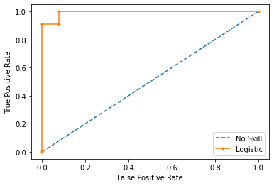

# **TinyAutoML**

[](https://github.com/g0bel1n/TinyAutoML/actions/workflows/python-app.yml)
[
](https://www.python.org/downloads/release/python-390/)


---

TinyAutoML is a Machine Learning Python3.9 library thought as an extension of Scikit-Learn. It builds an adaptable and auto-tuned pipeline to handle binary classification tasks.

In a few words, your data goes through 2 main preprocessing steps. The first one is scaling and NonStationnarity correction, which is followed by Lasso Feature selection. 

Finally, one of the three MetaModels is fitted on the transformed data.

Let's import the library !


```python
%pip install TinyAutoML
```

    Collecting TinyAutoML
      Downloading TinyAutoML-0.2.3.3.tar.gz (8.4 kB)
      Preparing metadata (setup.py) ... [?25l- done
    [?25hRequirement already satisfied: pandas in /opt/hostedtoolcache/Python/3.10.4/x64/lib/python3.10/site-packages (from TinyAutoML) (1.3.4)
    Requirement already satisfied: scikit-learn in /opt/hostedtoolcache/Python/3.10.4/x64/lib/python3.10/site-packages (from TinyAutoML) (1.0.2)
    Requirement already satisfied: tqdm in /opt/hostedtoolcache/Python/3.10.4/x64/lib/python3.10/site-packages (from TinyAutoML) (4.62.3)
    Requirement already satisfied: numpy in /opt/hostedtoolcache/Python/3.10.4/x64/lib/python3.10/site-packages (from TinyAutoML) (1.21.6)
    Requirement already satisfied: statsmodels in /opt/hostedtoolcache/Python/3.10.4/x64/lib/python3.10/site-packages (from TinyAutoML) (0.13.2)
    Requirement already satisfied: matplotlib in /opt/hostedtoolcache/Python/3.10.4/x64/lib/python3.10/site-packages (from TinyAutoML) (3.4.3)
    Requirement already satisfied: xgboost in /opt/hostedtoolcache/Python/3.10.4/x64/lib/python3.10/site-packages (from TinyAutoML) (1.5.2)
    Requirement already satisfied: cycler>=0.10 in /opt/hostedtoolcache/Python/3.10.4/x64/lib/python3.10/site-packages (from matplotlib->TinyAutoML) (0.11.0)
    Requirement already satisfied: kiwisolver>=1.0.1 in /opt/hostedtoolcache/Python/3.10.4/x64/lib/python3.10/site-packages (from matplotlib->TinyAutoML) (1.4.2)
    Requirement already satisfied: pillow>=6.2.0 in /opt/hostedtoolcache/Python/3.10.4/x64/lib/python3.10/site-packages (from matplotlib->TinyAutoML) (9.1.0)
    Requirement already satisfied: pyparsing>=2.2.1 in /opt/hostedtoolcache/Python/3.10.4/x64/lib/python3.10/site-packages (from matplotlib->TinyAutoML) (3.0.8)
    Requirement already satisfied: python-dateutil>=2.7 in /opt/hostedtoolcache/Python/3.10.4/x64/lib/python3.10/site-packages (from matplotlib->TinyAutoML) (2.8.2)
    Requirement already satisfied: pytz>=2017.3 in /opt/hostedtoolcache/Python/3.10.4/x64/lib/python3.10/site-packages (from pandas->TinyAutoML) (2022.1)
    Requirement already satisfied: threadpoolctl>=2.0.0 in /opt/hostedtoolcache/Python/3.10.4/x64/lib/python3.10/site-packages (from scikit-learn->TinyAutoML) (3.1.0)
    Requirement already satisfied: joblib>=0.11 in /opt/hostedtoolcache/Python/3.10.4/x64/lib/python3.10/site-packages (from scikit-learn->TinyAutoML) (1.1.0)
    Requirement already satisfied: scipy>=1.1.0 in /opt/hostedtoolcache/Python/3.10.4/x64/lib/python3.10/site-packages (from scikit-learn->TinyAutoML) (1.8.0)
    Requirement already satisfied: packaging>=21.3 in /opt/hostedtoolcache/Python/3.10.4/x64/lib/python3.10/site-packages (from statsmodels->TinyAutoML) (21.3)
    Requirement already satisfied: patsy>=0.5.2 in /opt/hostedtoolcache/Python/3.10.4/x64/lib/python3.10/site-packages (from statsmodels->TinyAutoML) (0.5.2)
    Requirement already satisfied: six in /opt/hostedtoolcache/Python/3.10.4/x64/lib/python3.10/site-packages (from patsy>=0.5.2->statsmodels->TinyAutoML) (1.16.0)
    Using legacy 'setup.py install' for TinyAutoML, since package 'wheel' is not installed.
    Installing collected packages: TinyAutoML
      Running setup.py install for TinyAutoML ... [?25l- done
    [?25hSuccessfully installed TinyAutoML-0.2.3.3
    Note: you may need to restart the kernel to use updated packages.


```python
import os
os.chdir('..')
```


```python
from TinyAutoML.Models import *
from TinyAutoML import MetaPipeline
```

## MetaModels

MetaModels inherit from the MetaModel Abstract Class. They all implement ensemble methods and therefore are based on EstimatorPools.

When training EstimatorPools, you are faced with a choice :  doing parameterTuning on entire pipelines with the estimators on the top or training the estimators using the same pipeline and only training the top. The first case refers to what we will be calling **comprehensiveSearch**.

Moreover, as we will see in details later, those EstimatorPools can be shared across MetaModels.

They are all initialised with those minimum arguments :

```python
MetaModel(comprehensiveSearch: bool = True, parameterTuning: bool = True, metrics: str = 'accuracy', nSplits: int=10)
```
- nSplits corresponds to the number of split of the cross validation
- The other parameters are equivoque


**They need to be put in the MetaPipeline wrapper to work**

**There are 3 MetaModels**

1- BestModel : selects the best performing model of the pool


```python
best_model = MetaPipeline(BestModel(comprehensiveSearch = False, parameterTuning = False))
```

2- OneRulerForAll : implements Stacking using a RandomForestClassifier by default. The user is free to use another classifier using the ruler arguments


```python
orfa_model = MetaPipeline(OneRulerForAll(comprehensiveSearch=False, parameterTuning=False))
```

3- DemocraticModel : implements Soft and Hard voting models through the voting argument


```python
democratic_model = MetaPipeline(DemocraticModel(comprehensiveSearch=False, parameterTuning=False, voting='soft'))
```

As of release v0.2.3.2 (13/04/2022) there are 5 models on which these MetaModels rely in the EstimatorPool:
- Random Forest Classifier
- Logistic Regression
- Gaussian Naive Bayes
- Linear Discriminant Analysis
- XGBoost


***


We'll use the breast_cancer dataset from sklearn as an example:


```python
import pandas as pd
from sklearn.datasets import load_breast_cancer

cancer = load_breast_cancer()
 
X = pd.DataFrame(data=cancer.data, columns=cancer.feature_names)
y = cancer.target

cut = int(len(y) * 0.8)

X_train, X_test = X[:cut], X[cut:]
y_train, y_test = y[:cut], y[cut:]
```

Let's train a BestModel first and reuse its Pool for the other MetaModels


```python
best_model.fit(X_train,y_train)
```

    [TinyAutoML] Training models...
    [TinyAutoML] The best estimator is random forest classifier with a cross-validation accuracy (in Sample) of 1.0


    MetaPipeline(model=BestModel(comprehensiveSearch=False, parameterTuning=False))


We can now extract the pool


```python
pool = best_model.get_pool()
```

And use it when fitting the other MetaModels to skip the fitting of the underlying models:


```python
orfa_model.fit(X_train,y_train,pool=pool)
democratic_model.fit(X_train,y_train,pool=pool)
```

    [TinyAutoML] Training models...
    [TinyAutoML] Training models...


    MetaPipeline(('model', Democratic Model))


Great ! Let's look at the results with the sk_learn classification report :


```python
orfa_model.classification_report(X_test,y_test)
```

                  precision    recall  f1-score   support
    
               0       0.96      0.92      0.94        26
               1       0.98      0.99      0.98        88
    
        accuracy                           0.97       114
       macro avg       0.97      0.96      0.96       114
    weighted avg       0.97      0.97      0.97       114
    


Looking good! What about the ROC Curve ?


```python
democratic_model.roc_curve(X_test,y_test)
```


    

    


Let's see how the estimators of the pool are doing individually:


```python
best_model.get_scores(X_test,y_test)
```


    [('random forest classifier', 0.9912280701754386),
     ('Logistic Regression', 0.9473684210526315),
     ('Gaussian Naive Bayes', 0.956140350877193),
     ('LDA', 0.9473684210526315),
     ('xgb', 0.956140350877193)]


## What's next ? 

You can do the same steps with comprehensiveSearch set to True if you have the time and if you want to improve your results. You can also try new rulers and so on.

Maria, Thomas and Lucas.
