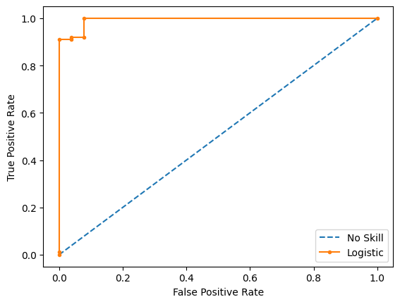

<h1 align="center">
  <br/>
</h1>


<p align="center">TinyAutoML is a Machine Learning Python3.9 library thought as an extension of Scikit-Learn.<br/> It builds an <b>adaptable</b> and <b>auto-tuned</b> pipeline to handle binary classification tasks.<br/> </p>


<p align="center">
<a href="https://github.com/g0bel1n/TinyAutoML/actions/workflows/python-app.yml" 
target="_blank"></a>


<a href="https://www.python.org/downloads/release/python-390/" 
target="_blank"></a>
</p>

---

<p align="center">
In a few words, your data goes through 2 main preprocessing steps. <br/>
The first one is scaling and NonStationnarity correction, which is followed by Lasso Feature selection.<br/>
Finally, one of the three <b>MetaModels</b> is fitted on the transformed data.
</p>


---

### Latest News ! :

* Logging format changed from default to [TinyAutoML]
* Added Github Actions Workflow for CI, for updating the README.md !
* Added parallel computation of `LassoFeatureSelector` -> [LassoFeatureSelectionParallel](https://github.com/g0bel1n/TinyAutoML/blob/master/TinyAutoML/Preprocessing/LassoFeatureSelectionParallel.py)
* New [example notebook](https://github.com/g0bel1n/TinyAutoML/blob/master/notebooks/vix_example.ipynb) based on VIX index directionnal forecasting


## ⚡️ Quick start 

First, let's install and import the library !

- Install the last release using pip

```python
%pip install TinyAutoML
````


```python
import os
os.chdir('..') #For Github CI, you don't have to run that
```


```python
from TinyAutoML.Models import *
from TinyAutoML import MetaPipeline
```

## `MetaModels`

`MetaModels` inherit from the `MetaModel` Abstract Class. They all implement ensemble methods and therefore are based on `EstimatorPools`.

When training `EstimatorPools`, you are faced with a choice :  doing `parameterTuning` on entire pipelines with the estimators on the top or training the estimators using the same pipeline and only training the top. The first case refers to what we will be calling `comprehensiveSearch`.

Moreover, as we will see in details later, those `EstimatorPools` can be shared across `MetaModels`.

They are all initialised with those minimum arguments :

```python
MetaModel(comprehensiveSearch: bool = True, parameterTuning: bool = True, metrics: str = 'accuracy', nSplits: int=10)
```
- `nSplits` corresponds to the number of split of the cross validation
- The other parameters are equivoque


**They need to be put in the `MetaPipeline` wrapper to work**

**There are 3 `MetaModels`**

1- `BestModel` : selects the best performing model of the pool


```python
best_model = MetaPipeline(BestModel(comprehensiveSearch = False, parameterTuning = False))
```

2- `OneRulerForAll` : implements Stacking using a `RandomForestClassifier` by default. The user is free to use another classifier using the ruler arguments


```python
orfa_model = MetaPipeline(OneRulerForAll(comprehensiveSearch=False, parameterTuning=False))
```

3- `DemocraticModel` : implements Soft and Hard voting models through the voting argument


```python
democratic_model = MetaPipeline(DemocraticModel(comprehensiveSearch=False, parameterTuning=False, voting='soft'))
```

As of release v0.2.3.2 (13/04/2022) there are 5 models on which these `MetaModels` rely in the `EstimatorPool`:
- Random Forest Classifier
- Logistic Regression
- Gaussian Naive Bayes
- Linear Discriminant Analysis
- XGBoost


***


We'll use the breast_cancer dataset from `sklearn` as an example:


```python
import pandas as pd
from sklearn.datasets import load_breast_cancer

cancer = load_breast_cancer()
 
X = pd.DataFrame(data=cancer.data, columns=cancer.feature_names)
y = cancer.target

cut = int(len(y) * 0.8)

X_train, X_test = X[:cut], X[cut:]
y_train, y_test = y[:cut], y[cut:]
```

Let's train a `BestModel` first and reuse its Pool for the other `MetaModels`


```python
best_model.fit(X_train,y_train)
```

    [TinyAutoML] Training models...
    [TinyAutoML] The best estimator is random forest classifier with a cross-validation accuracy (in Sample) of 1.0


    MetaPipeline(model=BestModel(comprehensiveSearch=False, parameterTuning=False))


We can now extract the pool


```python
pool = best_model.get_pool()
```

And use it when fitting the other `MetaModels` to skip the fitting of the underlying models:


```python
orfa_model.fit(X_train,y_train,pool=pool)
democratic_model.fit(X_train,y_train,pool=pool)
```

    [TinyAutoML] Training models...
    [TinyAutoML] Training models...


    MetaPipeline(('model', Democratic Model))


Great ! Let's look at the results with the sk_learn `classification_report` :


```python
orfa_model.classification_report(X_test,y_test)
```

                  precision    recall  f1-score   support
    
               0       0.93      0.96      0.94        26
               1       0.99      0.98      0.98        88
    
        accuracy                           0.97       114
       macro avg       0.96      0.97      0.96       114
    weighted avg       0.97      0.97      0.97       114
    


Looking good! What about the `roc_curve` ?


```python
democratic_model.roc_curve(X_test,y_test)
```


    

    


Let's see how the estimators of the pool are doing individually:


```python
best_model.get_scores(X_test,y_test)
```


    [('random forest classifier', 0.9912280701754386),
     ('Logistic Regression', 0.9473684210526315),
     ('Gaussian Naive Bayes', 0.956140350877193),
     ('LDA', 0.9473684210526315),
     ('xgb', 0.956140350877193)]


## What's next ? 

You can do the same steps with `comprehensiveSearch` set to True if you have the time and if you want to improve your results. You can also try new rulers and so on.
